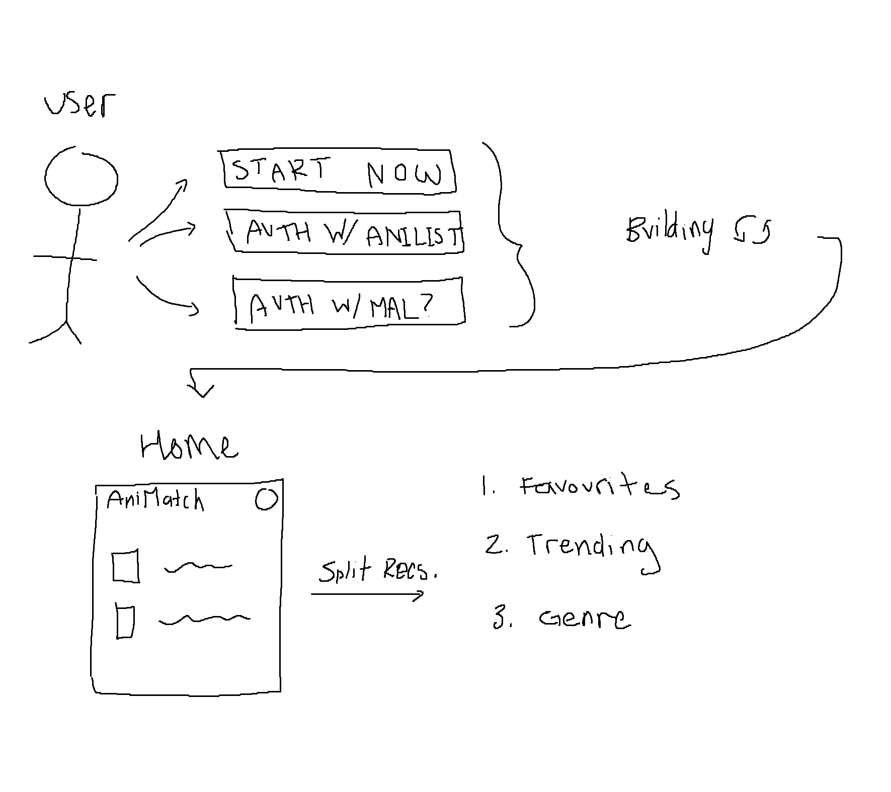

# AniMatch

- Style Guide for Python: https://peps.python.org/pep-0008/
- File Structure Guide: https://docs.python-guide.org/writing/structure/
- PyTorch TorchRec Tutorial: https://pytorch.org/tutorials/intermediate/torchrec_intro_tutorial.html
- PyTorch DataSets and DataLoaders: https://pytorch.org/tutorials/beginner/basics/data_tutorial.html#
- Recommender Systems Wikipedia: https://en.wikipedia.org/wiki/Recommender_system
- Sentence Transformers: https://sbert.net/index.html

- Vue: https://vuejs.org/guide/introduction.html

 

### Roadmap

- [ ] Back End
  - [x] User Auth
  - [x] Get AniList data from database
  - [ ] Create training data
  - [ ] Train a neural network
  - [ ] Actually get recommendations from the network
  - [ ] Connect with Front-End via RESTful implementation
- [ ] Front End
  - [ ] Landing Page
  - [ ] Auth Page
  - [ ] Home Page
  - [ ] User Page?